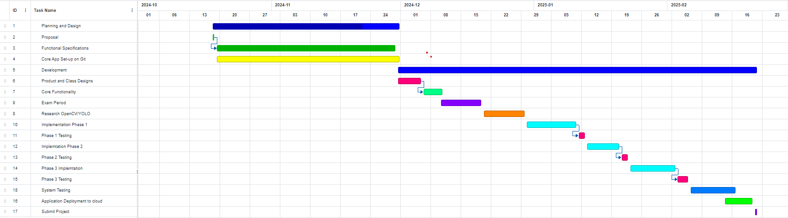
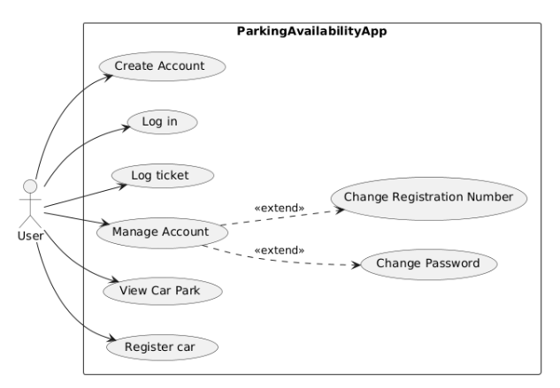
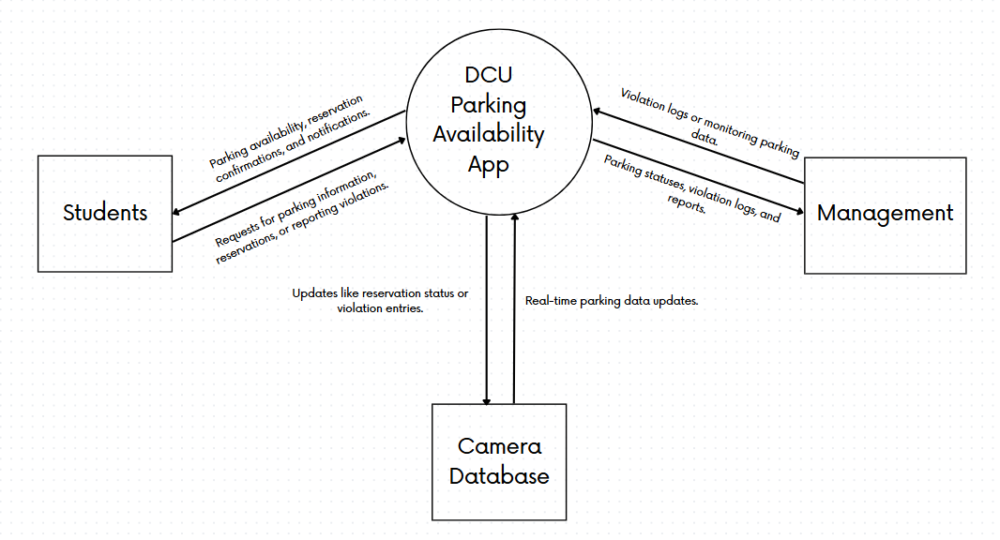
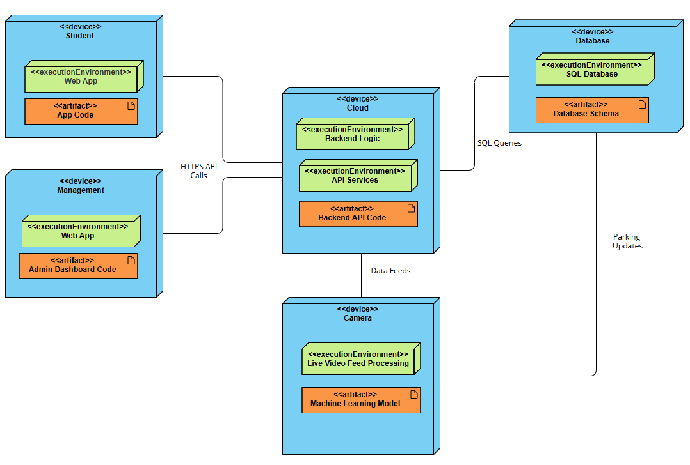
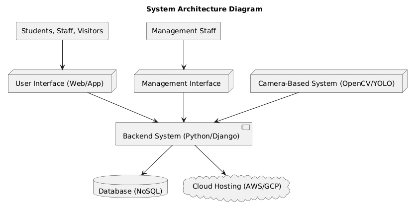
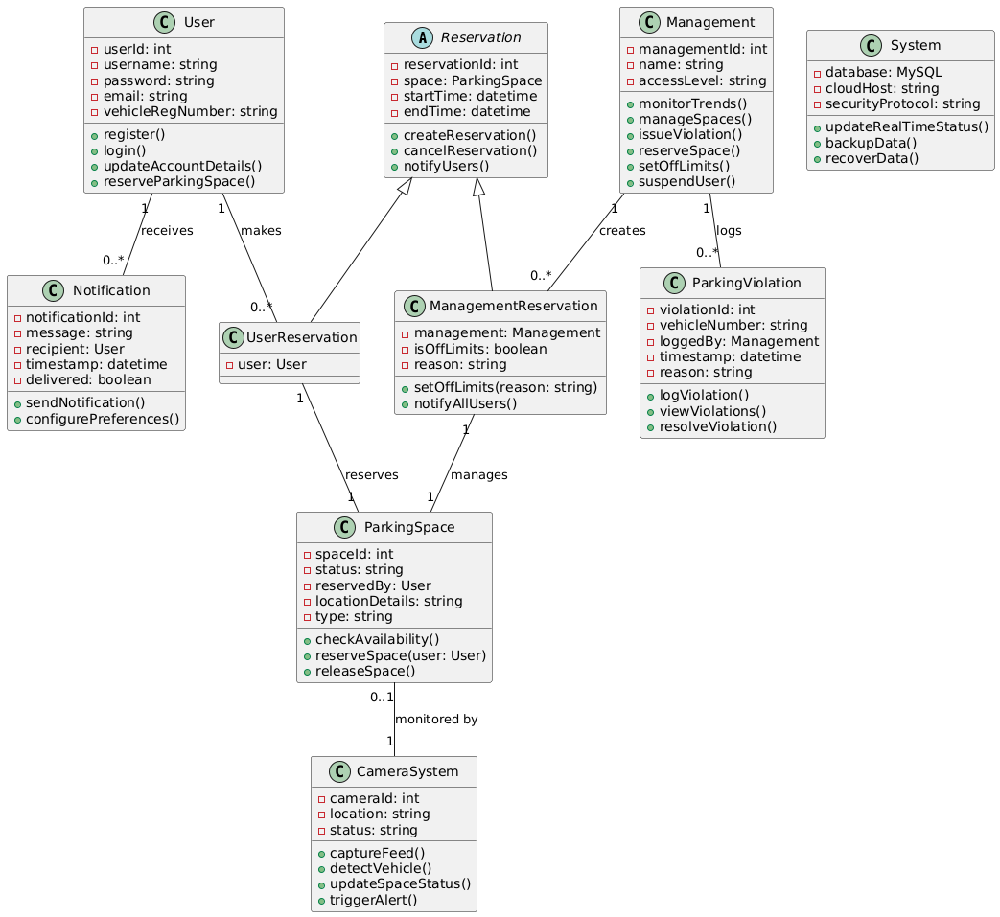

# **Functional Specifications**

**DCU Parking Availability App**

[Abul Hasan Sheik Madhar Ali](mailto:abul.sheikmadharali2@mail.dcu.ie) - 22390436

[Samuel Murphy](mailto:samuel.murphy394@mail.dcu.ie) - 22425664

# **Table of Contents**
#
|**Title**|**Page**|
| :- | :- |
|1. Introduction|4|
|`            `1.1 Overview|4|
|`            `1.2 Business Context|4|
|`            `1.3 Glossary|4|
|2. Overall Description|6|
|`            `2.1 Product Perspective|6|
|`                `2.1.1 System Interfaces|6|
|`                `2.1.2 Interfaces|6|
|`                `2.1.3 Hardware Interfaces|7|
|`                `2.1.4 Software Interfaces|7|
|`                `2.1.5 Communications Interfaces|7|
|`                `2.1.6 Memory Constraints|7|
|`                `2.1.7 Operations|8|
|`                `2.1.8 Site Adaptation Requirements|8|
|`           `2.2  User Characteristics|8|
|`           `2.3  Operational Scenarios |9|
|`           `2.4  Constraints |10|
|`           `2.5 Assumptions and Dependencies|11|
|3. Functional Requirements|11|
|`           `3.1 Functions|11|
|`                `3.1.1 User Login/Registration|11|
|`                `3.1.2 Parking Space Reservation|11|
|`                `3.1.3 Management Ticket Logging|12|
|`                `3.1.4 Visual Representation of Car Park|12|
|`                `3.1.5   Camera System|13|
|`                `3.1.6 Notifications System|13|
|`                `3.1.7 Real-Time Parking Availability Updates|13|
|`                `3.1.8 Heat Map of Parking Demand|14|
|`                `3.1.9 Parking Trends and Analytics Dashboard|14|
|4. System Architecture|14|
|5. High Level Design|15|
|6. Preliminary Schedule|16|
|`           `6.1 Project Phases and Tasks|16|
|`           `6.2 Resource Requirements|16|
|7. Appendices|17|

#

# **1.  Introduction**  

**1.1 Overview**  

The DCU Parking Availability App is a mobile and web-based system designed to assist with managing parking space availability on campus. The app provides real-time information about available parking spots, enabling students and staff to locate and reserve parking spaces efficiently. Additionally, it offers management features for administrative users to log parking violations and oversee parking activity.  

The system will collect and process real-time data through a custom-built database designed for this project. While not integrated with DCU's official infrastructure, the database will support accurate and dynamic updates, incorporating inputs such as camera feeds for vehicle detection to ensure practical functionality.  

**1.2 Business Context**  

This project is a student-led initiative aiming to address parking management challenges through a digital solution. The application is designed to streamline parking availability monitoring and reservation processes for users, including students, staff, and management.  

While initially developed with the DCU campus in mind, the system is flexible and could be adapted for use in other organizations or institutions with similar parking challenges, such as office complexes, event venues, or residential communities.  

The project aligns with the broader goal of leveraging technology to optimize resource management and enhance user experience. By reducing frustration caused by limited parking availability and improving traffic flow, the application has the potential to contribute to more efficient and user-friendly parking systems in various environments.

**1.3 Glossary**

**Parking Space Reservation:** The process of securing a parking spot for a specific duration, ensuring its availability for the user during that time.

**Car Park Visualization:** A dynamic, graphical representation of parking spaces, indicating their status (available, occupied, or reserved) through intuitive color codes.

**Camera Feed Integration:** The use of cameras to monitor parking areas, detecting vehicle presence and relaying this data to the application for real-time updates.

**Real-Time Data:** Continuously updated information that reflects the most current status of parking spaces without significant delays.

**Management Interface:** A specialized dashboard for administrators to monitor parking trends, manage reservations, and log violations.

**Student or Staff Interface**: A user-friendly dashboard tailored for students and staff, allowing access to functionalities like viewing real-time parking availability, reserving spaces, managing personal account details, and registering vehicles. The interface emphasizes simplicity and accessibility for everyday users.

**REST API:** A programming interface that facilitates communication between the app's frontend and backend using standard HTTP requests.

**OpenCV/YOLO:** Machine learning frameworks used for object detection and processing live camera feeds to identify parked vehicles.

**WebSocket:** A communication protocol enabling low-latency, real-time updates between the backend and the user interface.

**User Registration:** The process by which users create accounts, providing details like name, email, and car registration for app access.

**GDPR Compliance:** Adhering to data protection regulations to ensure user privacy and secure handling of personal information.

**Django Framework:** A high-level Python web framework that simplifies backend development by providing tools for database management, server-side logic, and user authentication.

**React:** A JavaScript library for building user interfaces, allowing the development of dynamic and responsive web and mobile applications.

**Cloud Deployment:** Hosting the application on cloud platforms such as AWS or Google Cloud, enabling scalability, availability, and efficient resource management.

**Docker:** A containerization tool that packages the application and its dependencies into portable containers for consistent deployment across different environments.

**SQL Database:** A structured database system used to store and manage data such as parking statuses, user accounts, and violation logs.

**Machine Learning Integration:** Incorporating algorithms to analyze camera feeds and automatically detect parked vehicles.

**CRUD Operations:** An acronym for Create, Read, Update, and Delete, referring to the fundamental operations required to manage data in a database or application.

#

# **2.  The Overall Description**  

## **2.1  Product Perspective** 
 The parking availability application is designed as an innovative solution to improve parking management. It integrates multiple technologies to ensure efficient real-time monitoring and a seamless user experience. The system operates through robust interactions between its backend, frontend, hardware, and cloud infrastructure.

### **2.1.1 System Interfaces**

The system relies on the following key interfaces for its functionality:

**Database Interface:** The application connects to a MySQL database that stores and retrieves real-time data, including parking space statuses, user account details, and ticket logs. The database ensures secure, consistent, and efficient data handling.

**Cloud Services Interface:** Cloud platforms such as AWS or Google Cloud host the application and enable containerized deployment using Docker. These services allow scalability and ensure high availability, handling variable user loads efficiently.

**Camera Feed Interface:** Cameras equipped with high-resolution video streaming capabilities and integrated with OpenCV/YOLO machine learning models detect vehicle presence. The processed data is continuously updated in the database, enabling real-time parking notifications and accurate parking statuses.

### **2.1.2 Interfaces**

The application provides the following primary interfaces:

**Student and Staff Interface:** This intuitive and responsive user interface is accessible via web and mobile devices. Users can:

- View real-time parking availability with a color-coded layout.
- Reserve parking spaces.
- Manage their account, including registering vehicles.
- Navigate a visual representation of parking areas with additional space details.

**Management Interface:** A dedicated interface for administrative staff, offering:

- Real-time monitoring of parking trends.
- Logging and management of parking violations.
- Space reservation management.
- Identification of unauthorized vehicles and advanced reporting.
###
###
###
### **2.1.3 Hardware Interfaces**

The system initially will not have direct hardware dependencies, as it primarily accesses a MySQl database. However, in Phase 3 of development, hardware dependencies include camera devices used for monitoring parking areas, with integration via the camera feed interface. These cameras will need to :

- Support high-resolution video streaming.
- Be compatible with OpenCV/YOLO for vehicle detection.
- Function effectively under various environmental conditions, such as rain, fog, or low-light scenarios.

#### **2.1.4 Software Interfaces**

The system utilizes a modern software stack to ensure performance and reliability:

**Backend:** Django framework (Python) for robust server-side logic.

**Frontend:** ReactJS framework (JavaScript) for dynamic and responsive user interfaces.

**Machine Learning:** OpenCV/YOLO for vehicle detection and image processing.

**Database:** MySQL for structured data storage and retrieval.

 
### **2.1.5 Communications Interfaces**

The application employs secure and efficient communication protocols:

**HTTPS:** Encrypts data transmission between the frontend and backend, ensuring the security of sensitive information, such as login credentials.

**REST API:** Enables interaction between the frontend and backend through standard CRUD operations, using JSON as the data exchange format.

**Websockets:** Provides low-latency real-time updates for parking statuses, reducing the need for frequent backend queries and improving responsiveness.

**Camera System Communication:** Facilitates the transmission of live video feeds to the backend for image processing and status updates.

### **2.1.6 Memory Constraints**

The system will be designed to operate efficiently within the following memory constraints:

**Database Memory Usage:**
The MySQL database will store user data, parking information, and ticket logs. Indexing on frequently queried fields will minimize memory overhead.

**Camera Feed Processing:**
Memory will be allocated for processing live video feeds and for storing temporary images during vehicle detection. Frame processing will occur at an optimal rate to balance performance and memory usage.

**Frontend Memory Requirements:**
The web and mobile apps will display real-time parking data and visualizations with minimal memory usage, utilizing lightweight libraries and caching to reduce overhead.

**Backend Memory Utilization:**
The backend, built with Django, will manage user requests and database interactions. Memory management will focus on optimized data structures and efficient response handling.

**Cloud Infrastructure:**
Cloud instances will scale based on workload, with Docker containerization ensuring resource-efficient deployment.

### **2.1.7 Operations**
The application supports the following operations:

**Interactive Operations:** Users can actively log in, view parking statuses, reserve spaces, and update account details during normal operating hours.

**Unattended Operations:** The backend continuously updates parking availability, processes camera feeds, and synchronizes data with the database, ensuring seamless operation even without user interaction.

**Data Backup and Recovery:** Regular backups will secure user and parking data, with robust recovery mechanisms in case of failures.
### **2.1.8 Site Adaptation Requirements**

An area/vantage point for the camera system must be identified, for the camera to to be installed and configured in order to enable real-time parking detecting. The camera feed must be linked to the backend system for image processing and internet connectivity must be ensured for live streaming.

## **2.2  User Characteristics** 

The Parking Availability app targets two primary user groups: student/staff users and campus management.

**Student/Staff Users:**

Users include undergraduate and postgraduate students, as well as academic administrative staff, with varying degrees of familiarity with digital tools.

Most users have moderate experience with mobile and web applications.

The application will feature a user-friendly design with:

- Clear icons.
- Minimal navigation steps.
- Intuitive interactions to enhance accessibility.

To increase learnability, the application will include characteristics commonly found in other apps.

Users may have basic familiarity with the layout of on-campus parking but may be unfamiliar with real-time parking apps.

A straightforward process with clear instructions will be implemented for parking space selection and checking availability.

The interface will follow ubiquitous functionality, similar to booking systems like cinema ticket booking.

**Management Users:**

Includes administrative and security staff with at least a high school education, often with specific training for campus operations.

Management may have moderate to advanced knowledge of technology, particularly in monitoring and handling campus operations.

The management interface will prioritize:

Quick and efficient navigation for easy access to data.

Emphasis on complex functionalities such as:

- Parking space reservation.
- Tracking parking violations.
- Detailed data views.

Management users possess a large knowledge base of parking layout, regulations, enforcement, and monitoring trends.
## **2.3  Operational Scenarios** 

**Scenario 1:** A student logs into the app and checks for available parking spaces. The app shows real-time availability with color-coded statuses (green for available, red for occupied). The student selects an available spot and proceeds with the reservation.

**Scenario 2:** A management user logs a violation for a car parked in a reserved space. The violation is logged with the car's registration number and timestamp. 

**Scenario 3:** A student receives a notification 30 minutes before their parking reservation expires, reminding them to vacate the space or extend the reservation.

**Scenario 4:** A student arrives at their reserved parking spot but finds that the space is occupied by another vehicle. The app allows the student to report the issue, which is logged for management to review.

**Scenario 5:** A management user reviews the real-time parking status on the app’s dashboard, which shows a heat map of high-demand areas on campus. The user checks if any reserved spots are being misused and decides whether to issue a violation.

**Scenario 6:** A student wants to view parking availability for future days. The app allows them to check availability for specific times on selected dates, allowing for advanced reservations.

**Scenario 7:** A student’s parking reservation expires, and they forget to vacate the spot. The app notifies management of the overstay, allowing them to take appropriate action, such as logging a violation or notifying the user.

**Scenario 8:** A management user adds temporary parking restrictions in a lot due to maintenance. The app updates the affected spots as unavailable and notifies users with active reservations.

**Scenario 9:** A student uses the app’s accessibility feature to find a parking space designed for individuals with disabilities. The app ensures only users with verified accessibility needs can reserve these spaces.
##
## **2.4  Constraints**  

**GDPR Compliance:** As the system collects and processes user data eg. car registration numbers, account details, it must adhere to GDPR(General Data Protection Regulation for data privacy and security.

**Camera-Based System:** Phase 3’s implementation relies on hardware with sufficient processing power to run OpenCV/YOLO for live video analysis. Camera hardware must be capable of delivering real-time, high resolution feeds. Camere hardware must be usable in various environmental eg. Raining, Foggy, Night time.

**Time Constraints:** The project completion due date for DCU the 21st of February 2025, it may be difficult to sufficiently test the camera-based system in various environments eg. hail-stones, snowing.

**Parallel Ability and Scalability:** The application must support concurrent users without degradation in performance, the system must be able handle handle simultaneous requests for parking availability and updates from both user and management interfaces and these updates must be immediately visible to all other users of the system.

**Language Requirements:** The backend of the system has to be implemented in python with the Django framework and the frontend in Javascript with the React Js framework.

##
## **2.5 Assumptions and Dependencies**

We will have access to a camera which has the required quality for OpenCV/YOLO to be able to process the image when it is monitoring the car park

Each car park user will have access to the application via the internet and will have the ability to log their car when parked and record when they leave the car park.

# **3.  Functional Requirements**  
##
## **3.1 Functions**

**3.1.1 User Login/Registration**

*Description:*

Users must be able to create accounts, log in securely and customize account details, including adding or updating car registration numbers

*Criticality:*

Medium - While not critical for viewing general parking availability, this feature is necessary for personalized services like reserving spots and logging tickets

*Technical Issues:*

Users' information must be securely stored and any transmission of user credentials must be done using encrypted connections. All data collecting must be in compliance of GDPR guidelines

*Dependencies on other requirements:*

Required for access to personalized features such as reservations and ticket logging. Interacts with the database to store user credentials and account information.

**3.1.2 Parking Space Reservation**

*Description:*

Users must be able to reserve a parking space through the app, which should reflect the reserved status immediately across the system.

*Criticality:*

High – Reservation functionality adds significant value by guaranteeing parking availability for users.

*Technical Issues:*

Managing concurrency when multiple users attempt to reserve the same spot.

Implementing a timer or expiration logic for unused reservations.

Updating the backend and UI in real-time to reflect reserved status.

*Dependencies on other requirements:*

Dependent on user authentication to ensure only registered users can reserve spots.

Requires integration with the real-time parking availability system.

**3.1.3 Management Ticket Logging**

*Description:*

Management staff must be able to log parking violations, including car registration numbers, time, and reasons for the violation.

*Criticality:*

Medium – Helps ensure proper use of parking spaces but does not directly affect core app functionality.

*Technical Issues:*

Requires a well-structured database to store and retrieve violation logs.

Need for input validation to minimize errors during data entry.

*Dependencies with Other Requirements:*

Relies on user registration and car registration data to match logged violations with accounts.

Requires an intuitive UI for management staff to easily log violations.

**3.1.4 Visual Representation of Car Park**

*Description: *

Users must be able to view the visual representation of each car park, they will be able to to view which parking area is available via a color coded system, green for available parking, red for unavailable parking and purple for reserved parking. The user will be able to tap on a parking space and be able to view information about that parking space.

*Criticality:*

Low -  Although a visual representation would increase the accessibility for the user as they would have an easier visual representation of the parking space they are booking, it is not needed for app functionality.

*Technical Issues:*

Rendering real-time data as an interactive graphic without overloading memory. Ensuring compatibility with both mobile and web interfaces for smooth interaction

*Dependencies with Other Requirements:*

Relies on real-time parking availability data and requires integration with the reservation and management systems for updates.

**3.1.5   Camera System**

*Description:*

Cameras monitor parking areas to detect vehicle presence, with data processed to update real-time parking availability and detect unauthorized parking.

*Criticality:*

Medium - Ensures accurate real-time updates and supports violation detection for management but it isn’t essential as the user inputs could do the same function

*Technical Issues:*

Integrating camera feeds with the system backend using OpenCV/YOLO and managing large volumes of video data efficiently to process frames in real-time.

Ensuring robust internet connectivity to avoid disruptions in live data updates.

*Dependencies on other Requirements:*

Relies on backend processing to interpret camera data and update the database and works with the visual representation and reservation systems for seamless integration.

**3.1.6 Notifications System**

*Description:*

The system provides notifications to users for events such as reservation expiration reminders, parking violations, or updates on space availability.

*Criticality:*

Medium - Enhances user experience by ensuring they are informed in a timely manner but is not critical to the core functionality.

*Technical Issues:*

Designing a robust notification system for mobile and web platforms.

Managing notification preferences for users enabling/disabling alerts).

*Dependencies on other Requirements:*

Relies on the reservation and parking availability systems for trigger points.

Requires user authentication to ensure notifications are sent to the right accounts.

**3.1.7 Real-Time Parking Availability Updates**

*Description:*

The system must display real-time parking availability updates, showing the current status of all spaces in color-coded format (green for available, red for occupied, purple for reserved).

*Criticality:*

High - A core functionality of the app that directly impacts user experience and satisfaction.

*Technical Issues:*

Ensuring minimal latency in updating parking status.

Balancing server query frequency and app responsiveness to optimize system performance.

*Dependencies on Other Requirements:*

Requires integration with the database for real-time data storage.

Relies on camera feed processing or manual updates to track parking space status.

**3.1.8 Heat Map of Parking Demand**

*Description:*

The app provides a heat map of parking areas, highlighting high-demand and low-demand zones based on historical and current data.

*Criticality:*

Low - Primarily useful for management and advanced users.

*Technical Issues:*

Aggregating data for visualization without excessive computation.

Optimizing the display for both mobile and web interfaces.

*Dependencies on Other Requirements:*

Relies on historical usage data and real-time parking updates.

Requires integration with the visual representation of car parks.

**3.1.9 Parking Trends and Analytics Dashboard**

*Description:*

Management users can view detailed analytics, such as peak usage times, most reserved spaces, and violation statistics, to optimize campus parking management.

*Criticality:*

Medium - Aids in long-term planning and efficient management but does not affect day-to-day operations.

*Technical Issues:*

Aggregating large volumes of historical data for analysis.

Ensuring data visualization is clear and actionable.

*Dependencies on Other Requirements:*

Relies on accurate data logging for reservations and violations.

Requires a secure management interface for access.

**4. System Architecture**

The architecture of the DCU Parking Availability App is composed of several modules:

**Frontend Module:** The frontend will be developed using ReactJS for both the web and mobile interfaces. It will interact with the backend to display real-time data and handle user interactions.

**Backend Module:** The backend will be built using Django, which will handle requests from the frontend, manage user authentication, process parking reservations, and log parking violations.

**Database Module:** A MySQL database will store user data, parking space statuses, reservations, and violation logs. The database will be updated in real-time.

**Camera Feed Module:** This will use OpenCV and YOLO to detect parking space occupancy and update the backend in real time.

**5. High Level Design**

The high-level design of the DCU Parking Availability App outlines the major components and their interactions within the system. The app is structured to ensure efficient management of parking space reservations, real-time availability updates, and violation logging while providing a seamless user experience. The design emphasizes modularity, scalability, and ease of integration with external systems, such as camera feeds for live parking monitoring.

Key components of the high-level design include:

**Frontend Module:** The user interface is built using ReactJS for both web and mobile platforms. It provides an interactive, intuitive experience for both students and management users to interact with parking space availability, make reservations, and view real-time updates.

**Backend Module:** Powered by Django, the backend handles user authentication, parking reservation logic, and management tasks. It communicates with the database to manage real-time parking availability, logs parking violations, and processes camera feed data (in Phase 3).

**Database Module:** A MySQL database stores essential data such as user details, parking space statuses, reservation logs, and violation records. The database ensures real-time updates, with efficient querying to support concurrent users.

**Camera Feed Integration:** In Phase 3, the camera module will use OpenCV and YOLO to process live video feeds for parking space occupancy detection. This system integrates with the backend to update parking space status and assist management in detecting violations.

The design ensures that all modules work together seamlessly, enabling users to reserve parking spots, view availability, and receive notifications in real time, while management can monitor parking trends, enforce rules, and generate reports.

**6. Preliminary Schedule**

The project will be completed in phases, each with its own tasks and deadlines:

**6.1 Project Phases and Tasks**

**Phase 1 (Planning & Design):**

Proposal (18/10/24)

Functional Specifications (29/11/24)

Core App Set-up on Git (29/11/24)

**Phase 2 (Development):**

Product and Class Designs (5/12/24)

Core Functionality such as user registration/login (10/12/24)

Exam Period (19/12/24)

Research and test initial OpenCV/YOLO implementation (20/12/29)

Implementation Phase 1 (10/01/25)

Phase 1 Testing (12/01/25)

Implementation Phase 2 (20/01/25)

Phase 2 Testing (22/01/25)

Implementation Phase 3 (02/02/25)

Phase 3 Testing (05/02/25)

**Phase 3 (Testing & Deployment):**

Testing all of the functionalities and camera implementation (16/02/25)

Deploy app to cloud infrastructure (20/02/25)

Re-test of all the functionalities before uploading the project (21/02/25)

**6.2 Resource Requirements**

**Hardware Resources:**

Development devices (laptops, desktops).

Placeholder still images for Phase 1 testing.

Camera systems for Phase 3 (if implemented).

**Software Resources:**

Development: Django, React, MySQL, OpenCV, YOLO.

Deployment: Docker, AWS/Google Cloud services.

**Wetware Resources (Personnel):**

Team members

Supervisor input for guidance during critical phases.

**7. Appendices**

*Fig 1 Use Case Diagram*

*Fig 2 Level 0 Data Flow Diagram*

*Fig 3 UML Deployment Diagram*

*Fig 4 System Architecture Diagram*

*Fig 5 Inital Class Diagram*

