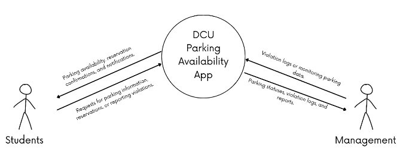
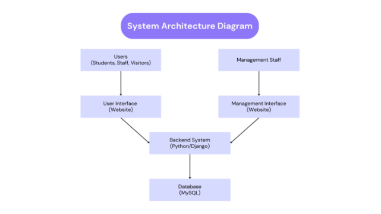

**Technical Specifications**

DCU Parking Availability App

[Abul Hasan Sheik Madhar Ali](mailto:abul.sheikmadharali2@mail.dcu.ie) - 22390436

[Samuel Murphy](mailto:samuel.murphy394@mail.dcu.ie) - 22425664

**Table of Contents**

|**Title**|**Page**|
| :- | :- |
|1. Overview|2|
|2. Glossary|2|
|3. System Architecture|4|
|4. High Level Design|5|
|5. Problems and Resolutions|6|
|`               `5.1 User Authentication Issues|6|
|`               `5.2 API and Frontend Integration Delays|6|
|`               `5.3 Django Admin Panel Limitations|7|
|`               `5.4 Database Normalization and Optimization|7|
|`               `5.5 Time Constraints on OpenCV/YOLO Camera Integration|8|
|6. Installation Guide|8|
|7. Appendix|11|

**1 Overview**  

The DCU Parking Availability App is a web-based system designed to enhance the management of parking spaces on campus. The app provides real-time information on available parking spots, allowing students and staff to locate and reserve spaces efficiently. Additionally, it includes administrative tools for management staff to log parking violations and oversee space utilization.

The system operates through a MySQL database, designed specifically for this project, to store and process parking-related data. It dynamically updates parking availability based on user interactions. While not officially integrated with DCU’s infrastructure, the platform is structured to handle high traffic demands and ensure scalability for future expansions.

In its initial phase, the system relies on manual user input and administrative oversight to track parking availability and violations. However, future iterations aim to incorporate AI-powered image processing using OpenCV and YOLO to automate the detection of occupied spaces through camera feeds. The app is designed to be accessible via desktop and mobile browsers, with potential mobile app integration in later phases.

Security and usability are key considerations, with role-based access control ensuring that general users, parking attendants, and system administrators have the appropriate permissions. The system employs secure authentication (JWT-based sessions) and GDPR-compliant data handling to protect user information.

Overall, the DCU Parking Availability App aims to reduce parking-related inefficiencies, minimize unauthorized usage of spaces, and provide a seamless digital solution for managing campus parking.

**2 Glossary**

**REST API:** A programming interface that facilitates communication between the app's frontend and backend using standard HTTP requests.

**OpenCV/YOLO:** Machine learning frameworks used for object detection and processing live camera feeds to identify parked vehicles.

**GDPR Compliance:** Adhering to data protection regulations to ensure user privacy and secure handling of personal information.

**Django Framework:** A high-level Python web framework that simplifies backend development by providing tools for database management, server-side logic, and user authentication.

**React:** A JavaScript library for building user interfaces, allowing the development of dynamic and responsive web and mobile applications.

**Cloud Deployment:** Hosting the application on cloud platforms such as AWS or Google Cloud, enabling scalability, availability, and efficient resource management.

**Docker:** A containerization tool that packages the application and its dependencies into portable containers for consistent deployment across different environments.

**SQL Database:** A structured database system used to store and manage data such as parking statuses, user accounts, and violation logs.

**Machine Learning Integration:** Incorporating algorithms to analyze camera feeds and automatically detect parked vehicles.

**CRUD Operations:** An acronym for Create, Read, Update, and Delete, referring to the fundamental operations required to manage data in a database or application.

**CSRF Token (Cross-Site Request Forgery Token):** A security measure used in web applications to prevent unauthorized commands being transmitted from a user’s browser, ensuring that requests come from legitimate sources.

**DRF (Django REST Framework):** A powerful toolkit for building RESTful APIs in Django, simplifying serialization, authentication, and API request handling.

**JWT (JSON Web Token):** A compact and secure method for transmitting user authentication and session data between the frontend and backend. Used for managing user logins and authorizations in a stateless manner.

**Authentication & Authorization:** The processes of verifying user identities (authentication) and granting specific permissions to access certain features (authorization). The app utilizes **JWT-based authentication** and **role-based access control (RBAC)**.

**Middleware:** Software components that sit between the frontend and backend, handling processes such as authentication, security, and request processing in Django.

**CORS (Cross-Origin Resource Sharing):** A security feature that regulates which domains are allowed to interact with the backend API, preventing unauthorized external access.

**RESTful API:** An API design principle that structures endpoints in a way that follows standard HTTP methods (**GET, POST, PUT, DELETE**) to interact with resources efficiently.

**Load Balancing:** A technique used in cloud deployment to distribute incoming traffic across multiple servers, improving reliability and performance.

**Session Management:** Handling user login sessions securely, ensuring that users remain authenticated across multiple interactions with the system.

**Data Encryption:** The process of encoding sensitive user data, such as passwords and payment information, to prevent unauthorized access.

**CI/CD (Continuous Integration & Continuous Deployment):** A DevOps practice that automates code integration, testing, and deployment to streamline software updates.

**Error Handling & Logging:** Implementing mechanisms to capture and manage application errors while maintaining logs for debugging and monitoring purposes.

**Environment Variables:** Configuration settings stored outside the application code (e.g., API keys, database credentials) to enhance security and flexibility.

**Unit Testing & Integration Testing:** Testing methodologies to validate individual components (unit testing) and the interaction between multiple components (integration testing) to ensure system reliability.

**Version Control (Git/GitHub):** A system for tracking changes in source code, enabling team collaboration and maintaining historical records of modifications.

**3 System Architecture**

The DCU Parking Availability App follows a three-tier architecture, with the following key components:

**Frontend (ReactJS)**

The frontend is built using ReactJS, providing a dynamic and interactive user experience. Key features include:

- **User Dashboard:** Allows users to check real-time parking availability, make reservations, and manage their profiles.
- **Management Dashboard:** Enables administrative users to monitor parking occupancy, log violations, and oversee parking activity.
- **API Communication:** Utilizes REST API calls to interact with the backend, fetching data for parking availability, user authentication, and reservation management.
- **WebSocket Integration:** Implements real-time updates for parking availability, reducing the need for frequent page refreshes.

**Backend (Django)**

The backend is powered by Django, handling core business logic and ensuring secure, scalable operations. Major functions include:

- **User Authentication:** Implements secure login/logout functionality using DRF authentication for session management.
- **Role-Based Access Control:** Differentiates access levels between regular users and management staff, ensuring data privacy and control.
- **Parking Reservation System:** Manages the logic for booking, modifying, and cancelling parking reservations while preventing double bookings.
- **Violation Logging:** Allows management users to log and track parking violations, integrating with the database for record-keeping.
- **Data Security & Compliance:** Ensures GDPR compliance by encrypting sensitive user data and implementing CSRF protection for secure API interactions.
- **Performance Optimization:** Uses caching mechanisms and optimized database queries to ensure fast response times even under heavy usage.

**Database (MySQL)**

The system relies on a MySQL database for structured data storage and efficient query performance. It handles:

- **User Information:** Stores registered users' details, including authentication credentials, roles, and car registration numbers.
- **Parking Space Data:** Maintains records of parking spots, including availability status, location details, and historical usage.
- **Reservations & Bookings:** Tracks parking reservations with timestamps, assigned spaces, and user details.
- **Violation Logs:** Stores information on reported violations, including timestamps, images (if applicable), and the type of infraction.
- **Real-Time Query Support:** Implements indexing and optimized queries to handle concurrent user requests without performance degradation.

**Camera Feed Integration (Future Phase)**

In later phases, the system will incorporate OpenCV and YOLO for automated parking space detection using live camera feeds. This feature will:

- **Detect Parked Vehicles:** Utilize **computer vision to recognize cars and determine which spots are occupied.**
- **Update Parking Availability in Real-Time:** Communicate directly with the backend to ensure the parking status remains accurate without manual input.
- **Assist in Violation Detection:** Enable automated violation logging by detecting unauthorized parking in restricted areas.
- **Optimize Performance with Edge Processing:** Minimize server load by processing camera feeds on the edge before sending analyzed data to the backend.

**4. High Level Design**

The high-level design of the DCU Parking Availability App outlines the major components and their interactions within the system. The app is structured to ensure efficient management of parking space reservations, real-time availability updates, and violation logging while providing a seamless user experience. The design emphasizes modularity, scalability, and ease of integration with external systems, such as camera feeds for live parking monitoring.

Key components of the high-level design include:

**Frontend Module:** The user interface is built using ReactJS for both web and mobile platforms. It provides an interactive, intuitive experience for both students and management users to interact with parking space availability, make reservations, and view real-time updates.

**Backend Module:** Powered by Django, the backend handles user authentication, parking reservation logic, and management tasks. It communicates with the database to manage real-time parking availability and logs parking violations.

**Database Module:** A MySQL database stores essential data such as user details, parking space statuses, reservation logs, and violation records. The database ensures real-time updates, with efficient querying to support concurrent users.

**5. Problems and Resolution**

Challenges Faced and Solutions

**5.1 User Authentication Issues**

- **Problem:** Initially, we implemented Django's built-in authentication system using CSRF tokens for session-based authentication. This worked for a while, but as we moved to a more API-driven architecture with React, we ran into issues with authentication persistence. The CSRF tokens were tied to Django’s session mechanism, which became unreliable when handling login requests from the frontend. Users would get logged out unexpectedly, and the authentication state wasn’t persisting across sessions properly.
- **Resolution:** We decided to implement Django Rest Framework (DRF) authentication for a more robust and flexible authentication system. DRF simplifies user authentication by providing built-in views and serializers for handling tokens. By using DRF’s token authentication, we ensure that the application remains stateless, with each request containing an authentication token. This eliminates the need for session management, making it more scalable. It also supports features like token expiration and refresh mechanisms, enhancing security. DRF’s built-in tools make it easier to integrate with other services, while offering a smooth, secure experience for users.

**5.2 API and Frontend Integration Delays**

- **Problem:** Several issues arose when connecting the React frontend with the Django REST API. Initially, some React components weren’t rendering data correctly because of CORS (Cross-Origin Resource Sharing) restrictions, and in other cases, the structure of API responses didn't match what the frontend expected.
- **Resolution:** We addressed CORS issues by configuring Django’s settings to explicitly allow requests from our frontend domain using django-cors-headers. Additionally, we restructured API responses to be more consistent and predictable, ensuring the frontend had clear expectations for data format. Improved error handling was also implemented on both ends to prevent silent failures and provide meaningful messages when issues arose.

**5.3 Django Admin Panel Limitations**

- **Problem:** While Django provides a built-in admin panel, it didn’t meet our project’s requirements for parking management. The default admin page was useful for debugging but lacked the necessary UI and functionality for real-time monitoring, violation logging, and administrative controls.
- **Resolution:** We researched custom user roles and permissions in Django and implemented two separate interfaces: one for regular users and another for management staff. This required creating a custom Manager model, setting up role-based authentication, and developing a dedicated management dashboard with the necessary tools for handling reservations and violations. This approach provided a more user-friendly and efficient way to oversee parking operations.

**5.4 Database Normalization and Optimization**

- **Problem:** In the early stages of development, our database design had some redundant data and poorly structured relationships, leading to inefficiencies in querying and updating records. For example, initial implementations stored separate parking space records without a well-defined relationship to parking locations, which made it difficult to manage multiple lots efficiently.
- **Resolution:** We applied database normalization techniques to eliminate redundancy and ensure better data integrity. Specifically:
  - Introduced foreign key relationships between parking spaces and locations.
  - Used Many-to-Many relationships where applicable (e.g., linking users to multiple parking reservations).
  - Indexed frequently queried fields to improve performance.
  - Migrated old data to the new schema while ensuring backward compatibility with existing API endpoints.

**5.5 Time Constraints on OpenCV/YOLO Camera Integration**

- **Problem:** The original plan included integrating OpenCV and YOLO for automated parking space detection using live camera feeds. However, due to time constraints, we couldn’t complete this phase as it required significant effort in setting up real-time image processing, model training, and performance optimization.
- **Resolution:** We decided to postpone the implementation of the camera-based detection system to a future phase. Instead, we focused on ensuring the manual reservation system and real-time updates were robust and scalable. This decision allowed us to deliver a functional MVP while leaving room for enhancements in later iterations.

**6. Installation Guide**

This section provides a step-by-step guide to installing and running the **DCU Parking Availability App** on a local machine. The installation process includes setting up the backend, frontend, and database while ensuring all dependencies are correctly configured.

**6.1 Prerequisites**

Before installing the system, ensure you have the following software installed:

**Required Software & Tools**

|**Tool**|**Purpose**|
| :- | :- |
|**Python 3.x**|Required for running the Django backend.|
|**Node.js & npm**|Needed for the React frontend. npm is a package manager for installing dependencies.|
|**MySQL**|The relational database system for storing user data, parking details, and reservations.|
|**Docker (Optional)**|Used for containerized deployment to ensure consistency across different environments.|

**6.2 Installation Steps**

**Step 1: Clone the Repository**

The first step is to download the project code from the repository.

git clone https://github.com/your-repo-url

cd project-directory

- git clone downloads the project from GitHub.
- cd project-directory navigates into the project folder.

**Step 2: Backend Setup (Django)**

The backend is built using **Django** and handles authentication, API endpoints, and database interactions.

**Navigate to the backend directory**

cd backend

**Install dependencies**
   Install the required Python packages listed in requirements.txt:

pip install -r requirements.txt

**Apply database migrations**
   This sets up the necessary database tables:

python manage.py migrate

**Create a superuser (admin account)**
   This allows access to the Django admin panel:

python manage.py createsuperuser

Follow the prompts to enter a username, email, and password.

**Run the backend server**
   Start the Django development server:

python manage.py runserver

The backend should now be accessible at **http://127.0.0.1:8000/**.

**Step 3: Frontend Setup (React)**

The frontend is built using **ReactJS** and communicates with the backend via REST API.

**Navigate to the frontend directory**

cd frontend

**Install dependencies**
   Run the following command to install all required Node.js packages:

npm install

**Start the frontend server**

npm start

The frontend should now be accessible at [**http://localhost:3000/**](http://localhost:3000/).

**Step 4: Database Setup (MySQL)**

The system uses **MySQL** as the primary database.

**Open MySQL** and log in:

mysql -u root -p

(Enter your MySQL root password when prompted.)

**Create a new database**

CREATE DATABASE parking\_system;

**Create a user and grant permissions**

GRANT ALL PRIVILEGES ON parking\_system.\* TO 'admin'@'localhost' IDENTIFIED BY 'password';

FLUSH PRIVILEGES;

This creates a user named **admin** with the password **password** and grants full access to the parking\_system database.
Change 'password' to a more secure value.
**Exit MySQL**

exit;

**Step 5: Running the Application**

After completing the setup, the application can be started:

**Start the Django backend**

python manage.py runserver

Runs on **http://127.0.0.1:8000/**.
**Start the React frontend**

npm start

Runs on [**http://localhost:3000/**](http://localhost:3000/).
**Access the system**
   Open [**http://localhost:3000/**](http://localhost:3000/) in a web browser to use the parking system.

**6.3 Optional: Running with Docker**

For users who prefer a **containerized environment**, Docker can simplify deployment:

**Ensure Docker is installed and running**.
**Build and run the application** using Docker Compose:

docker-compose up --build

This will start the frontend, backend, and database in isolated containers.

**6.4 Troubleshooting**

|**Issue**|**Solution**|
| :- | :- |
|Backend does not start|Ensure Python dependencies are installed: pip install -r requirements.txt|
|Database connection error|Verify MySQL is running and the user credentials are correct.|
|CORS errors in frontend|Check Django CORS\_ALLOWED\_ORIGINS settings and ensure frontend URL is whitelisted.|
|React app does not load|Delete node\_modules and reinstall: rm -rf node\_modules && npm install|

**7.Appendix**

*Fig 7.1 Data Flow Diagram*

*Fig 7.2 System Architecture Diagram*
2

