**User Manual**

DCU Parking Availability App

[Abul Hasan Sheik Madhar Ali](mailto:abul.sheikmadharali2@mail.dcu.ie) - 22390436

[Samuel Murphy](mailto:samuel.murphy394@mail.dcu.ie) - 22425664

**Installation**

This section provides a step-by-step guide to installing and running the **DCU Parking Availability App** on a local machine. The installation process includes setting up the backend, frontend, and database while ensuring all dependencies are correctly configured.

**Prerequisites**

Before installing the system, ensure you have the following software installed:

**Required Software & Tools**

|**Tool**|**Purpose**|
| :- | :- |
|**Python 3.x**|Required for running the Django backend.|
|**Node.js & npm**|Needed for the React frontend. npm is a package manager for installing dependencies.|
|**MySQL**|The relational database system for storing user data, parking details, and reservations.|
|**Docker (Optional)**|Used for containerized deployment to ensure consistency across different environments.|

**Installation Steps**

**Step 1: Clone the Repository**

The first step is to download the project code from the repository.

git clone https://github.com/your-repo-url

cd project-directory

- git clone downloads the project from GitHub.
- cd project-directory navigates into the project folder.

**Step 2: Backend Setup (Django)**

The backend is built using **Django** and handles authentication, API endpoints, and database interactions.

1. **Navigate to the backend directory**

cd backend

1. **Install dependencies**
   Install the required Python packages listed in requirements.txt:

pip install -r requirements.txt

1. **Apply database migrations**
   This sets up the necessary database tables:

python manage.py migrate

1. **Create a superuser (admin account)**
   This allows access to the Django admin panel:

python manage.py createsuperuser

Follow the prompts to enter a username, email, and password.

1. **Run the backend server**
   Start the Django development server:

python manage.py runserver

1. The backend should now be accessible at **http://127.0.0.1:8000/**.

**Step 3: Frontend Setup (React)**

The frontend is built using **ReactJS** and communicates with the backend via REST API.

1. **Navigate to the frontend directory**

cd frontend

1. **Install dependencies**
   Run the following command to install all required Node.js packages:

npm install

1. **Start the frontend server**

npm start

1. The frontend should now be accessible at [**http://localhost:3000/**](http://localhost:3000/).

**Step 4: Database Setup (MySQL)**

The system uses **MySQL** as the primary database.

1. **Open MySQL** and log in:

mysql -u root -p

(Enter your MySQL root password when prompted.)

1. **Create a new database**

CREATE DATABASE parking\_system;

1. **Create a user and grant permissions**

GRANT ALL PRIVILEGES ON parking\_system.\* TO 'admin'@'localhost' IDENTIFIED BY 'password';

FLUSH PRIVILEGES;

1. This creates a user named **admin** with the password **password** and grants full access to the parking\_system database.
1. Change 'password' to a more secure value.
1. **Exit MySQL**

exit;

**Step 5: Running the Application**

After completing the setup, the application can be started:

1. **Start the Django backend**

python manage.py runserver

1. Runs on **http://127.0.0.1:8000/**.
1. **Start the React frontend**

npm start

1. Runs on [**http://localhost:3000/**](http://localhost:3000/).
1. **Access the system**
   Open [**http://localhost:3000/**](http://localhost:3000/) in a web browser to use the parking system.

**Optional: Running with Docker**

For users who prefer a **containerized environment**, Docker can simplify deployment:

1. **Ensure Docker is installed and running**.
1. **Build and run the application** using Docker Compose:

docker-compose up --build

This will start the frontend, backend, and database in isolated containers.

**Troubleshooting**

|**Issue**|**Solution**|
| :- | :- |
|Backend does not start|Ensure Python dependencies are installed: pip install -r requirements.txt|
|Database connection error|Verify MySQL is running and the user credentials are correct.|
|CORS errors in frontend|Check Django CORS\_ALLOWED\_ORIGINS settings and ensure frontend URL is whitelisted.|
|React app does not load|Delete node\_modules and reinstall: rm -rf node\_modules && npm install|

**App Guide**

**Home Page**

The landing page users see upon opening the app.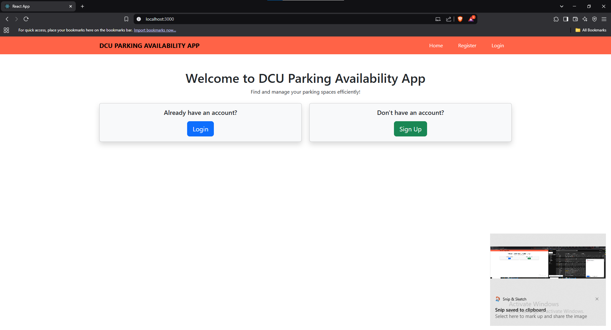

**Registration Page**

Allows new users to create an account by entering their details.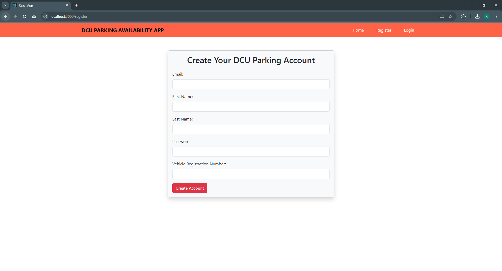

**Login Page**

Users and managers log in here. The system directs them to their respective dashboards.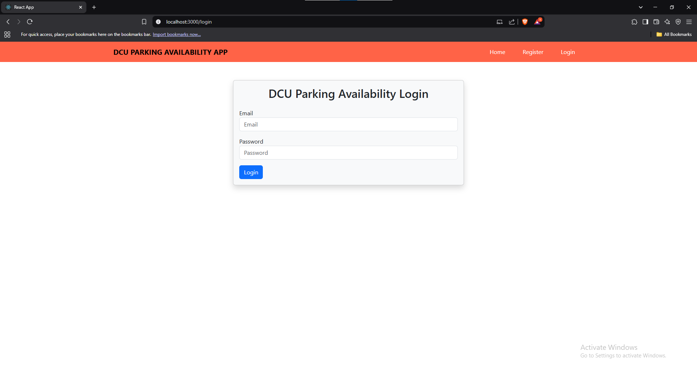

**User Dashboard Page**

Displays user details such as name, email, and vehicle registration number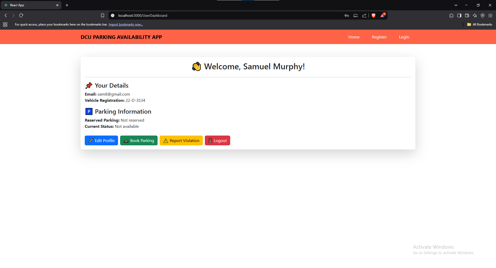

**Edit Profile Page**

Users can update their profile details.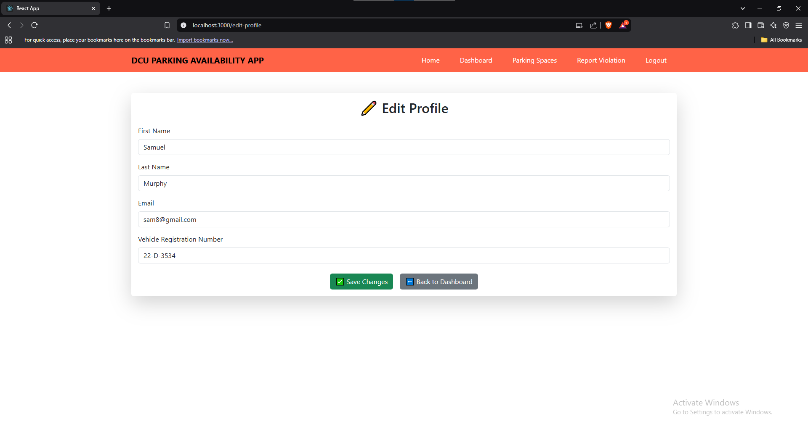

**Parking Location Page**

Lists available parking locations and the number of available spaces.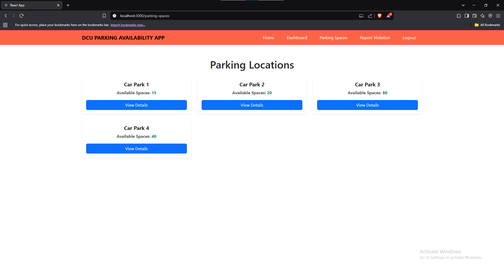

**Parking Spots Page**

Shows individual parking lots with three types of spaces: Electric, Handicap or standard.

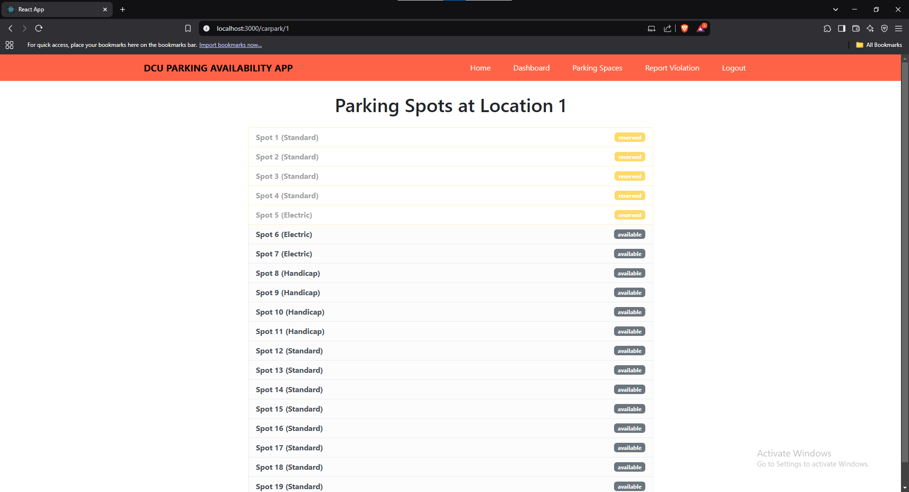

**Parking Space Details Page**

Provides details about a specific parking space.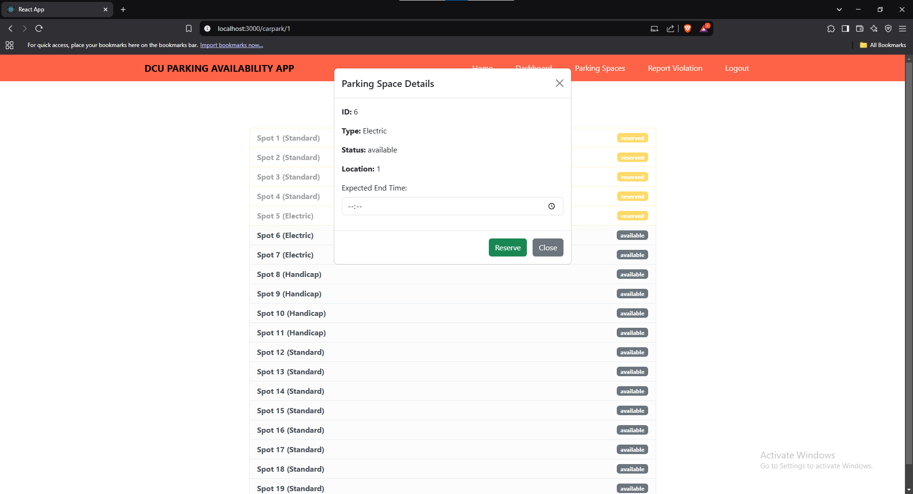

**Log Parking Violation Page**

Users can report parking violations, which management can review.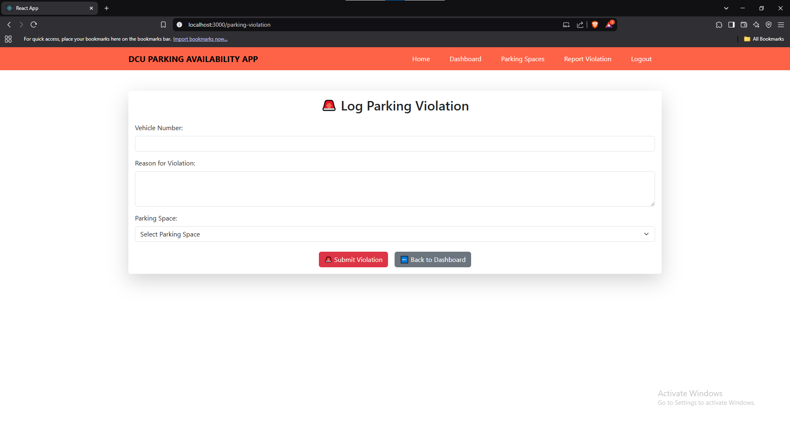

**Manager Dashboard Page**

Displays management-specific data and controls.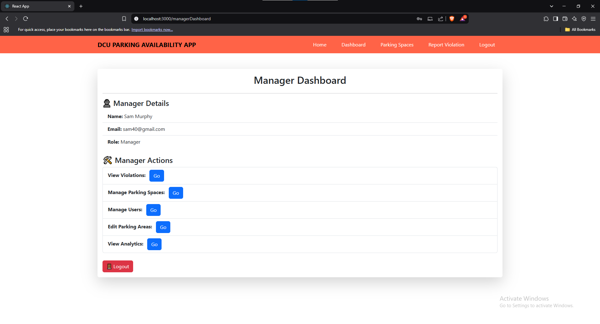

**Manage Users Page**

Management can view and manage all registered users.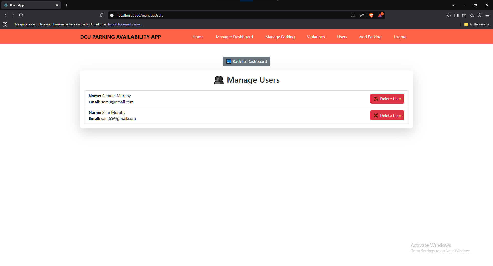

**Parking Violations Page**

Managers can view reported violations and take necessary action.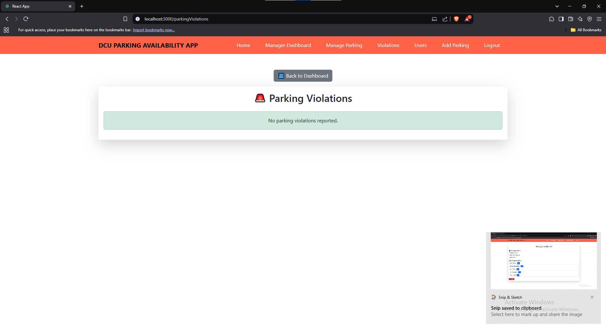

**Manage Parking Areas Page**

Allows managers to create or remove parking lots.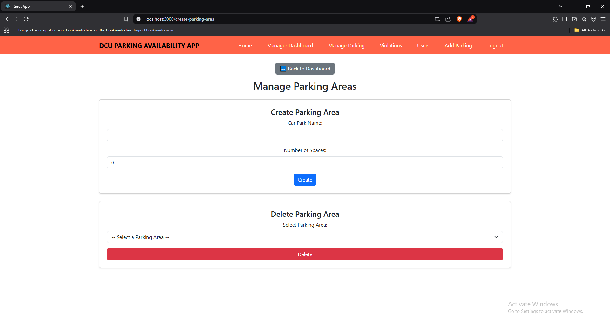

**Conclusion**

This guide provides step-by-step instructions to install, run, and use the DCU Parking Availability App. If you encounter issues, refer to the troubleshooting section or consult the documentation for further support.
